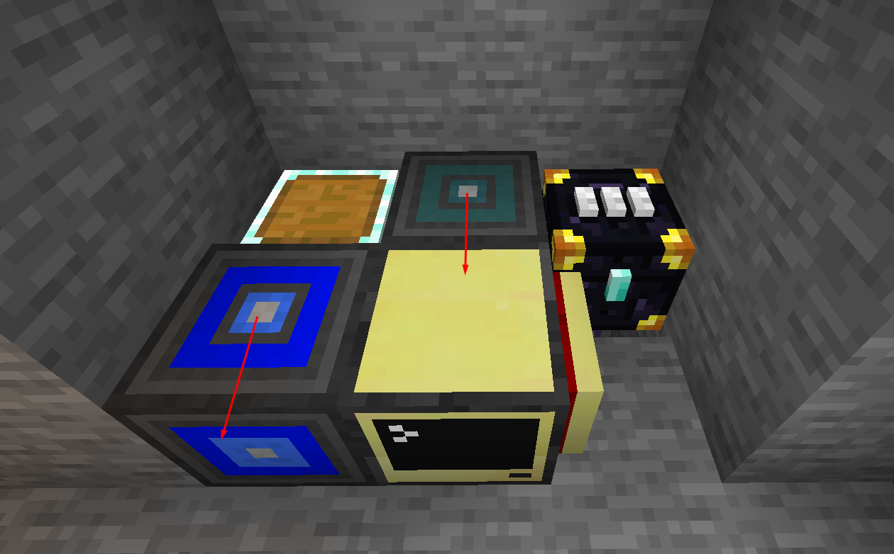

## Storage Manager (Inventory Manager)

A script that allows you to pick up, craft and consult items from your AE2 or Refined Storage with a simple command 
in chat via ChatBox or in a 
[Pocket Universal Remote Console](https://github.com/Playerrs/CCrepo/tree/master/UniversalRemoteConsole) 
using [RemoteAPI](https://github.com/Playerrs/CCrepo/blob/master/APIs/RemoteAPI) below an image of how to set up.
If you are going to use it with ChatBox just change the Ender Modem for it. The arrows indicate the position that the 
block is "Looking at" (the front part of it is at the point)

Um script que permite você a pegar, craftar e consultar itens do seu AE2 ou Refined Storage com um simples comando no 
chat via ChatBox ou em um Pocket 
via [Pocket Universal Remote Console](https://github.com/Playerrs/CCrepo/tree/master/UniversalRemoteConsole) usando
[RemoteAPI](https://github.com/Playerrs/CCrepo/blob/master/APIs/RemoteAPI)
abaixo uma imagem de como montar o setup. Se você for usar com o ChatBox é só mudar o Ender Modem por ela. As setas 
indicam a posição que o bloco esta "Olhando" (a parte da frende dele está a pontada)

